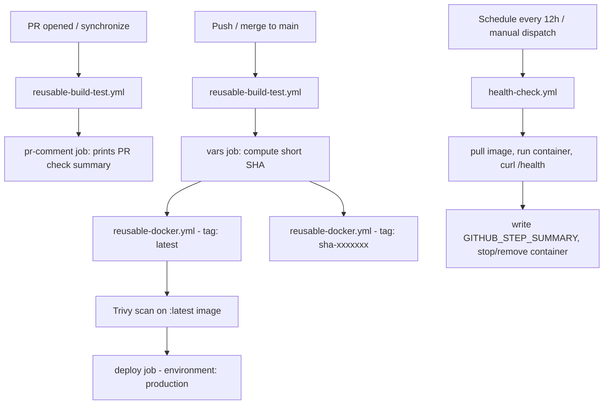

# Day 48 – GitHub Actions Project: End-to-End CI/CD Pipeline

**Repo:** `github-actions-capstone`
**App:** Python Flask, one `/health` endpoint (plus a `/` root endpoint)

This capstone pulls together everything from Day 40–47: workflows, triggers,
secrets, Docker builds, reusable workflows, and advanced events, into one
pipeline that tests every PR, and builds/scans/deploys every merge to `main`.

---

## 1. Pipeline Architecture



Text version, for reference:

- **PR opened → main**: `pr-pipeline.yml` calls `reusable-build-test.yml` →
  `pr-comment` job prints `PR checks passed for branch: <branch>`. No Docker
  build, no push.
- **Merge to main**: `main-pipeline.yml` calls `reusable-build-test.yml` →
  computes short SHA → calls `reusable-docker.yml` twice (once for `latest`,
  once for `sha-<short>`) → runs `aquasecurity/trivy-action` against the
  `:latest` image, failing on CRITICAL CVEs and uploading the report → `deploy`
  job runs under the `production` environment (manual approval if required
  reviewers are configured).
- **Every 12 hours**: `health-check.yml` pulls the latest image, runs it
  detached, waits 5s, curls `/health`, writes a `$GITHUB_STEP_SUMMARY` report,
  then tears the container down.

---

## 2. Workflow Files

### `.github/workflows/reusable-build-test.yml`

```yaml
name: Reusable - Build & Test

on:
  workflow_call:
    inputs:
      python_version:
        description: "Python version to use"
        type: string
        default: "3.12"
      run_tests:
        description: "Whether to run the test suite"
        type: boolean
        default: true
    outputs:
      test_result:
        description: "Result of the test run: passed, failed, or skipped"
        value: ${{ jobs.build-test.outputs.test_result }}

jobs:
  build-test:
    runs-on: ubuntu-latest
    outputs:
      test_result: ${{ steps.set-result.outputs.test_result }}
    steps:
      - name: Check out code
        uses: actions/checkout@v4

      - name: Set up Python
        uses: actions/setup-python@v5
        with:
          python-version: ${{ inputs.python_version }}

      - name: Install dependencies
        run: |
          python -m pip install --upgrade pip
          pip install -r requirements.txt

      - name: Run tests
        id: run-tests
        if: ${{ inputs.run_tests }}
        run: pytest -v

      - name: Set test result output
        id: set-result
        if: always()
        run: |
          if [ "${{ inputs.run_tests }}" = "false" ]; then
            echo "test_result=skipped" >> "$GITHUB_OUTPUT"
          elif [ "${{ steps.run-tests.outcome }}" = "success" ]; then
            echo "test_result=passed" >> "$GITHUB_OUTPUT"
          else
            echo "test_result=failed" >> "$GITHUB_OUTPUT"
          fi
```

### `.github/workflows/reusable-docker.yml`

```yaml
name: Reusable - Docker Build & Push

on:
  workflow_call:
    inputs:
      image_name:
        description: "Docker image name (without registry or tag)"
        type: string
        required: true
      tag:
        description: "Tag to apply to the image"
        type: string
        required: true
    secrets:
      docker_username:
        required: true
      docker_token:
        required: true
    outputs:
      image_url:
        description: "Full pushed image path"
        value: ${{ jobs.docker-build-push.outputs.image_url }}

jobs:
  docker-build-push:
    runs-on: ubuntu-latest
    outputs:
      image_url: ${{ steps.set-output.outputs.image_url }}
    steps:
      - name: Check out code
        uses: actions/checkout@v4

      - name: Log in to Docker Hub
        uses: docker/login-action@v3
        with:
          username: ${{ secrets.docker_username }}
          password: ${{ secrets.docker_token }}

      - name: Build and push image
        uses: docker/build-push-action@v6
        with:
          context: .
          push: true
          tags: ${{ secrets.docker_username }}/${{ inputs.image_name }}:${{ inputs.tag }}

      - name: Set image_url output
        id: set-output
        run: |
          echo "image_url=${{ secrets.docker_username }}/${{ inputs.image_name }}:${{ inputs.tag }}" >> "$GITHUB_OUTPUT"
```

### `.github/workflows/pr-pipeline.yml`

```yaml
name: PR Pipeline

on:
  pull_request:
    branches: [main]
    types: [opened, synchronize]

jobs:
  build-test:
    uses: ./.github/workflows/reusable-build-test.yml
    with:
      python_version: "3.12"
      run_tests: true

  pr-comment:
    needs: build-test
    runs-on: ubuntu-latest
    steps:
      - name: Print PR summary
        run: |
          echo "PR checks passed for branch: ${{ github.head_ref }}"
          echo "Test result: ${{ needs.build-test.outputs.test_result }}"
```

### `.github/workflows/main-pipeline.yml`

```yaml
name: Main Branch Pipeline

on:
  push:
    branches: [main]

jobs:
  build-test:
    uses: ./.github/workflows/reusable-build-test.yml
    with:
      python_version: "3.12"
      run_tests: true

  vars:
    needs: build-test
    runs-on: ubuntu-latest
    outputs:
      short_sha: ${{ steps.sha.outputs.short_sha }}
    steps:
      - name: Compute short SHA
        id: sha
        run: echo "short_sha=$(echo ${{ github.sha }} | cut -c1-7)" >> "$GITHUB_OUTPUT"

  docker-latest:
    needs: vars
    uses: ./.github/workflows/reusable-docker.yml
    with:
      image_name: github-actions-capstone
      tag: latest
    secrets:
      docker_username: ${{ secrets.DOCKER_USERNAME }}
      docker_token: ${{ secrets.DOCKER_TOKEN }}

  docker-sha:
    needs: vars
    uses: ./.github/workflows/reusable-docker.yml
    with:
      image_name: github-actions-capstone
      tag: sha-${{ needs.vars.outputs.short_sha }}
    secrets:
      docker_username: ${{ secrets.DOCKER_USERNAME }}
      docker_token: ${{ secrets.DOCKER_TOKEN }}

  # Brownie points: DevSecOps scan on the freshly pushed :latest image
  trivy-scan:
    needs: docker-latest
    runs-on: ubuntu-latest
    steps:
      - name: Check out code
        uses: actions/checkout@v4

      - name: Run Trivy vulnerability scanner
        uses: aquasecurity/trivy-action@0.24.0
        with:
          image-ref: ${{ needs.docker-latest.outputs.image_url }}
          format: table
          severity: CRITICAL
          exit-code: "1"
          output: trivy-report.txt

      - name: Upload scan report
        if: always()
        uses: actions/upload-artifact@v4
        with:
          name: trivy-scan-report
          path: trivy-report.txt

  deploy:
    needs: [docker-latest, trivy-scan]
    runs-on: ubuntu-latest
    environment: production
    steps:
      - name: Deploy
        run: echo "Deploying image: ${{ needs.docker-latest.outputs.image_url }} to production"
```

### `.github/workflows/health-check.yml`

```yaml
name: Scheduled Health Check

on:
  schedule:
    - cron: "0 */12 * * *"
  workflow_dispatch:

jobs:
  health-check:
    runs-on: ubuntu-latest
    steps:
      - name: Pull latest image
        run: docker pull ${{ secrets.DOCKER_USERNAME }}/github-actions-capstone:latest

      - name: Run container
        run: |
          docker run -d --name capstone-app -p 5000:5000 \
            ${{ secrets.DOCKER_USERNAME }}/github-actions-capstone:latest

      - name: Wait for container to start
        run: sleep 5

      - name: Curl health endpoint
        id: healthcheck
        run: |
          response=$(curl -s -o /dev/null -w "%{http_code}" http://localhost:5000/health)
          echo "http_status=$response" >> "$GITHUB_OUTPUT"
          if [ "$response" -eq 200 ]; then
            echo "result=PASSED" >> "$GITHUB_OUTPUT"
          else
            echo "result=FAILED" >> "$GITHUB_OUTPUT"
          fi

      - name: Stop and remove container
        if: always()
        run: |
          docker stop capstone-app || true
          docker rm capstone-app || true

      - name: Write step summary
        if: always()
        run: |
          echo "## Health Check Report" >> $GITHUB_STEP_SUMMARY
          echo "- Image: ${{ secrets.DOCKER_USERNAME }}/github-actions-capstone:latest" >> $GITHUB_STEP_SUMMARY
          echo "- Status: ${{ steps.healthcheck.outputs.result }}" >> $GITHUB_STEP_SUMMARY
          echo "- Time: $(date)" >> $GITHUB_STEP_SUMMARY

      - name: Fail job if unhealthy
        if: steps.healthcheck.outputs.result == 'FAILED'
        run: exit 1
```

---

## 3. Verification Checklist

- [ ] Open a PR into `main` → `pr-pipeline.yml` runs `build-test` only,
      **no** Docker job appears in the run.
- [ ] Merge the PR → `main-pipeline.yml` runs in order:
      `build-test` → `vars` → `docker-latest` / `docker-sha` (parallel) →
      `trivy-scan` → `deploy` (paused for approval if `production` has
      required reviewers).
- [ ] `health-check.yml` shows up under **Actions → Scheduled Health Check**
      and can be triggered on demand via **Run workflow**.
- [ ] Repo README badges go green after each workflow's first run.

## 4. Screenshots

*(Add these once you've pushed the repo and run the pipelines.)*

- [ ] Screenshot: PR run showing test-only pipeline (no Docker job).
- [ ] Screenshot: `main` push running the full pipeline end to end.
- [ ] Screenshot: Trivy scan step / uploaded artifact.
- [ ] Screenshot: `$GITHUB_STEP_SUMMARY` output from `health-check.yml`.

## 5. Docker Hub

- Image: `docker.io/<your-dockerhub-username>/github-actions-capstone`
- Link: `https://hub.docker.com/r/<your-dockerhub-username>/github-actions-capstone`

*(Fill in once the first `main` push has pushed an image.)*

## 6. What I'd Add Next

- **Slack/Discord notifications** on deploy success/failure using
  `slackapi/slack-github-action`, posting the `image_url` and commit message.
- **Multi-environment promotion** (`staging` → `production`) with the same
  reusable Docker workflow, gated by separate GitHub Environments and
  distinct image tags (`staging-latest`, `prod-latest`).
- **Rollback job**: a `workflow_dispatch` input for a target tag, re-running
  the `deploy` job against a previously pushed image if the health check
  fails post-deploy.
- **Cache dependencies** (`actions/setup-python`'s built-in pip cache, or
  Docker layer caching via `docker/build-push-action`'s `cache-from`/
  `cache-to`) to speed up repeated runs.
- **Concurrency control** (`concurrency: main-pipeline`) so overlapping
  pushes to `main` don't race each other to deploy.
- **Branch protection** requiring the PR pipeline's `build-test` check to
  pass before merge is allowed.
